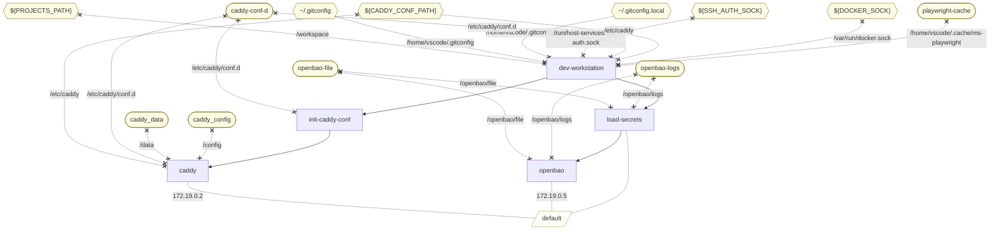

```mermaid
%%{init: {'theme': 'default'}}%%
flowchart TB
  VPROJECTSPATH{{"${PROJECTS_PATH}"}} x-. /workspace .-x devworkstation[dev-workstation]
  Vgitconfig{{"~/.gitconfig"}} -. "/home/vscode/.gitconfig" .-x devworkstation
  Vgitconfiglocal{{"~/.gitconfig.local"}} -. "/home/vscode/.gitconfig.local" .-x devworkstation
  VSSHAUTHSOCK{{"${SSH_AUTH_SOCK}"}} x-. "/run/host-services/ssh-auth.sock" .-x devworkstation
  Vcaddyconfd([caddy-conf-d]) x-. "/etc/caddy/conf.d" .-x devworkstation
  VCADDYCONFPATH{{"${CADDY_CONF_PATH}"}} -. /etc/caddy .-x devworkstation
  VDOCKERSOCK{{"${DOCKER_SOCK}"}} x-. "/var/run/docker.sock" .-x devworkstation
  Vplaywrightcache([playwright-cache]) x-. "/home/vscode/.cache/ms-playwright" .-x devworkstation
  VCADDYCONFPATH x-. /etc/caddy .-x caddy
  Vcaddyconfd x-. "/etc/caddy/conf.d" .-x caddy
  Vcaddydata([caddy_data]) x-. /data .-x caddy
  Vcaddyconfig([caddy_config]) x-. /config .-x caddy
  Vcaddyconfd x-. "/etc/caddy/conf.d" .-x initcaddyconf[init-caddy-conf]
  Vopenbaofile([openbao-file]) x-. /openbao/file .-x openbao
  Vopenbaologs([openbao-logs]) x-. /openbao/logs .-x openbao
  Vopenbaofile x-. /openbao/file .-x loadsecrets[load-secrets]
  Vopenbaologs x-. /openbao/logs .-x loadsecrets
  devworkstation --> initcaddyconf
  devworkstation --> loadsecrets
  initcaddyconf --> caddy
  loadsecrets --> openbao
  caddy -. "172.19.0.2" .- default[/default/]
  openbao -. "172.19.0.5" .- default
  loadsecrets -.- default

  classDef volumes fill:#fdfae4,stroke:#867a22
  class VPROJECTSPATH,Vgitconfig,Vgitconfiglocal,VSSHAUTHSOCK,Vcaddyconfd,VCADDYCONFPATH,VDOCKERSOCK,Vplaywrightcache,VCADDYCONFPATH,Vcaddyconfd,Vcaddydata,Vcaddyconfig,Vcaddyconfd,Vopenbaofile,Vopenbaologs,Vopenbaofile,Vopenbaologs volumes
  classDef nets fill:#fbfff7,stroke:#8bc34a
  class default nets
```
